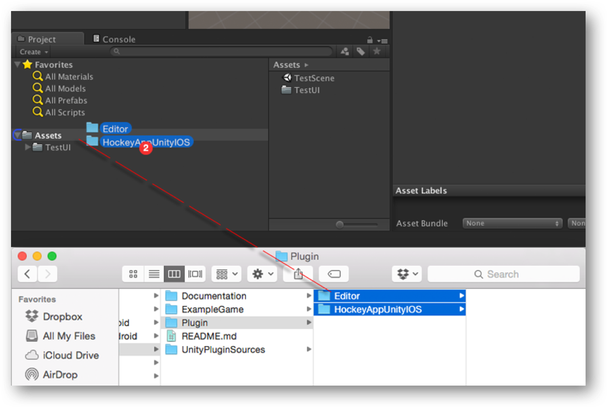
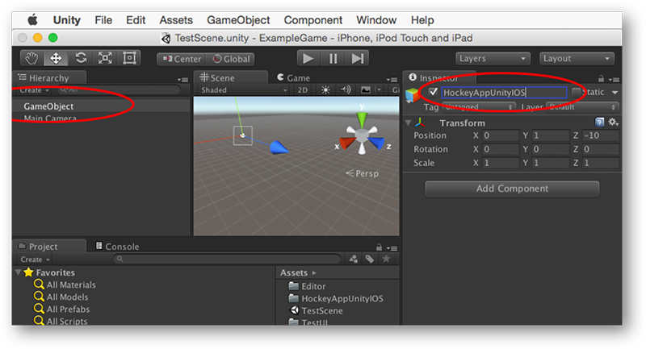
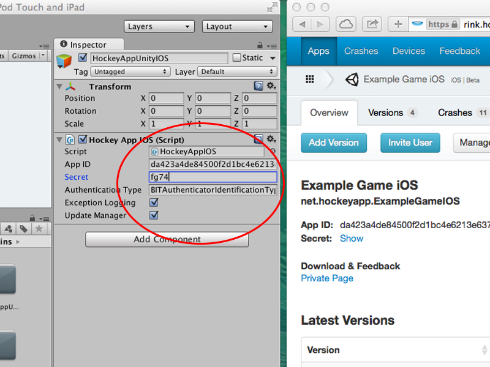
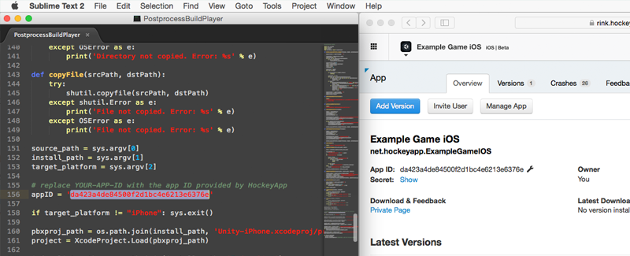
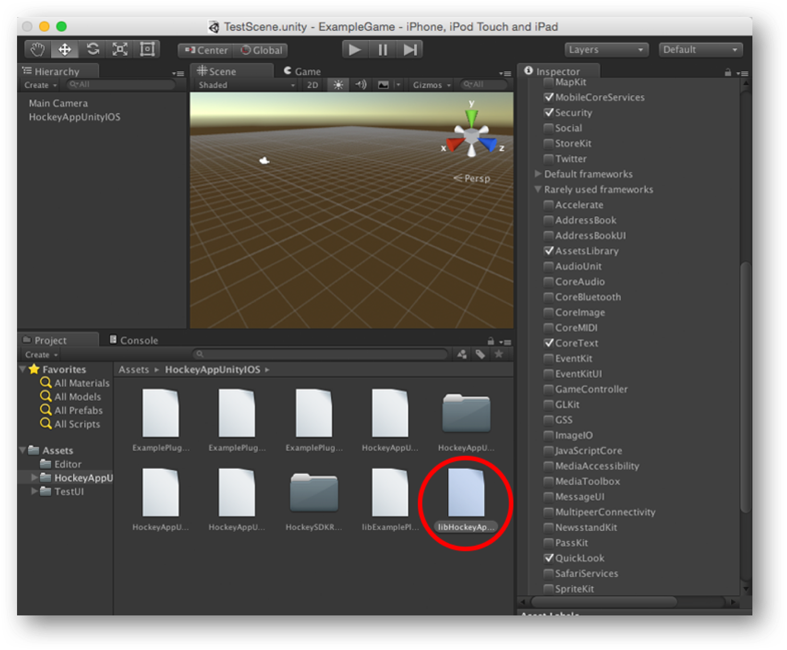
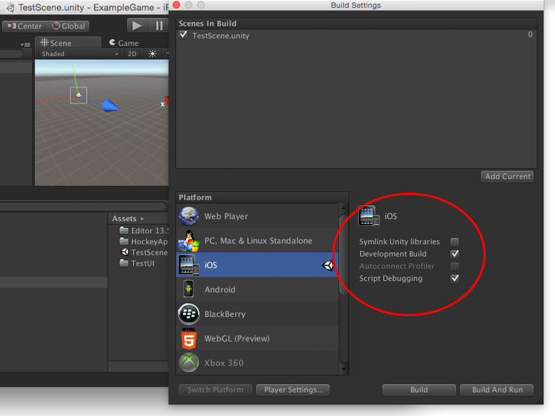
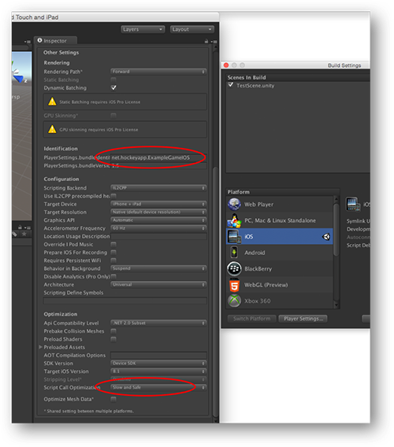
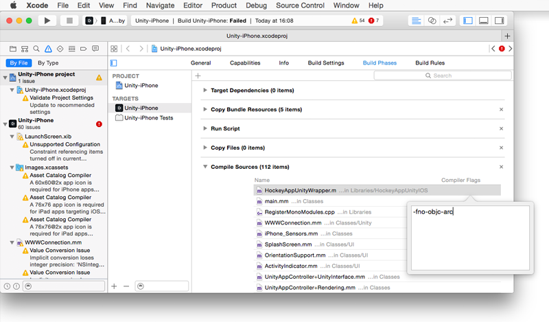

## Introduction 

The HockeyAppUnity-iOS plugin implements support for using HockeyApp in your Unity-iOS builds. It easily lets you keep track of crashes that have been caused by your scripts or Objective-C code.

1. [Requirements (Version 1.0.5)](#1)
2. [Installation & Setup](#2)
3. [Examples](#3)
4. [Troubleshooting](#4)
5. [Licenses](#5)

## Requirements (Version 1.0.6)
* [Changelog](Documentation/Changelog.md)

* Unity 5.0 or newer (SDK versions with Unity 4 support can be found at the [Unity Asset Store](https://www.assetstore.unity3d.com/en/?gclid=CO) or by switching to the appropriate release branch on GitHub).
* iOS 6.0 or newer.

## Installation & Setup

The following steps illustrate how to integrate the HockeyAppUnity-iOS plugin:

### 1) Import plugin
Copy the **HockeyAppUnityIOS** folder as well as the **Editor** folder into the **Assets** directory of your Unity project. Both folders are subdirectories of the **Plugin** folder.

### 2) Create plugin-GameObject
Create an empty game object (*GameObject -> Create Empty*) and rename it (*HockeyAppUnityIOS*).

Add the **HockeyAppIOS.cs** as a component of your new created gameobject.

Select the game object in the **Hierarchy** pane and fill in some additional informations inside the Inspector window. 

* **App ID** - the app ID provided by HockeyApp
* **Secret** - the secret provided by HockeyApp (only for authentication using email address)
* **Authenticator Type** - an authentication type (see [Authenticating Users on iOS](http://support.hockeyapp.net/kb/client-integration-ios-mac-os-x/authenticating-users-on-ios)). By default **BITAuthenticatorIdentificationTypeAnonymous** will be used.
* **Server URL** - if you have your own server instance, please type in its url. In most cases this field should be left blank.
* **Exception Logging** - by checking this option you will get more precise information about exceptions in your Unity scripts
* **Auto Upload** -  this option defines if the crash reporting feature should send crash reportings automatically without asking the user. 
* **Update Manager** - ckeck this option if users should be informed about app updates from inside your app

### 3) Modify post process script

Open PostProcessBuildPlayer (*Editor/PostProcessBuildPlayer*) and modify line 156:

### 4) Add dependencies

To make the HockeyApp SDK work properly, we have to add some dependencies. Select the file **libHockeyAppUnity.a** from the **HockeyAppUnityIOS** folder and check the following frameworks:

* AssetsLibrary
* CoreText
* MobileCoreServices
* QuickLook
* Security

### 5) Configure build settings

You are now ready to build the Xcode project: Select *File -> Build Settings...* and switch to **iOS** in the platform section. Check **Development Build** and **Script Debugging** (see [Build Settings](#build_settings) section).

Open the player settings and make sure that **Bundle identifier** (*Other settings -> Identification*) equals the bundle identifier of the app on HockeyApp (*Manage App -> Basic Data*).

If you want to enable exception logging, please also select *Other settings -> Optimization -> Slow and safe* as well. Otherwise all exceptions will result in an app crash.

Press the **Build** button. You can now build and run your app.

## Build Settings

The **Development Build** and **Script Debugging** options affect the exception handling in C#. You will get a crash report in any case, but the data quality differs. It is recommend to enable those options for alpha and beta builds, but to disable them for production.

**Disabled Development Build, Disabled Script Debugging**:
	
Apple-style crash report for those exception types that cause a crash.

**Enabled Development Build, Disabled Script Debugging**

	IndexOutOfRangeException: Array index is out of range.
 		at (wrapper stelemref) object:stelemref (object,intptr,object)
 		at TestUI.OnGUI ()
 		
**Enabled Development Build, Enabled Script Debugging**:

	IndexOutOfRangeException: Array index is out of range.
 		at (wrapper stelemref) object:stelemref (object,intptr,object)
 		at TestUI.OnGUI () (at /Users/name/Documents/Workspace/HockeySDK-Unity-iOS/ExampleGame/Assets/TestUI/TestUI.cs:73)
 		
## Examples

### Feedback Form

In order to provide your users with a feedback form, please define the following extern method in your C# script: 
	
	[DllImport("__Internal")]
	private static extern void HockeyApp_ShowFeedbackListView();
	
After that you can show the feedback form as follows:
	
	HockeyApp_ShowFeedbackListView(); 
	
## Troubleshooting

If you have any problems with compiling the exported xCode projects, please check the following points:

### Libraries group

After exporting your Unity project, your xCode project should now contain the following files:

* **libHockeyAppUnity.a** & **HockeyAppUnityWrapper.m** (*Libraries/HockeyAppUnityIOS/*)
* **HockeySDKResources.bundle** (*Frameworks/HockeyAppUnityIOS/*)

If not, compiling your project will lead to different errors, e.g.

	Undefined symbols for architecture armv7:
  	  "_OBJC_CLASS_$_HockeyAppUnity", referenced from:
      	objc-class-ref in HockeyAppUnityWrapper.o
      	objc-class-ref in UnityAppController.o
      	objc-class-ref in UnityAppController+ViewHandling.o
	ld: symbol(s) not found for architecture armv7
	clang: error: linker command failed with exit code 1 (use -v to see invocation)
	
or

	ld: warning: directory not found for option '-L"/Path/to/project/Libraries"'
	Undefined symbols for architecture armv7:
  	  "_HockeyApp_StartHockeyManager", referenced from:
	      RegisterMonoModules() in RegisterMonoModules.o
	  "_HockeyApp_ShowFeedbackListView", referenced from:
	      RegisterMonoModules() in RegisterMonoModules.o
	  "_HockeyApp_GetBundleIdentifier", referenced from:
	      RegisterMonoModules() in RegisterMonoModules.o
	  "_HockeyApp_GetAppVersion", referenced from:
	      RegisterMonoModules() in RegisterMonoModules.o
	ld: symbol(s) not found for architecture armv7
	clang: error: linker command failed with exit code 1 (use -v to see invocation)	

Please note that Unity only copies those files if you import them correctly. Go back to your Unity project – the files should be located at *Assets/Plugins/iOS*.

### Errors in HockeyAppUnityWrapper.m

If your Xcode gives you several errors for HockeyAppUnityWrapper.m, you'll have to set the `-fno-objc-arc` compiler flag under *Build Phases -> Compile Sources*

### PostprocessBuildPlayer

A lot of errors may occure if the **PostprocessBuildPlayer** file is not in the right directory of your Unity project. This file does some configuration to make the plugin work out of the box. It should be located at *Assets/Editor* of your Unity project.

#### Authentication type not working

Please open the **PostprocessBuildPlayer** file and make sure that it has been modified correctly (see [Modify post process script](#script_modification)).

The **info.plist** of your xCode project should contain the key **URL types** with your app ID as value of one of its children.

Furthermore, the following lines of code

	if([HockeyAppUnity handleOpenURL:url sourceApplication:sourceApplication annotation:annotation]){
        return YES;
    }

should be part of the method

	- (BOOL)application:(UIApplication*)application openURL:(NSURL*)url sourceApplication:(NSString*)sourceApplication annotation:(id)annotation

inside the class *Classes/UnityAppController.mm*.

#### Crash reporting / Feedback form / Update Manager not working

If the project compiles just fine but none of the features seem to work, please check the class *Classes/UI/UnityAppController+ViewHandling.mm*.

The last line of the method

	- (void)showGameUI
	
should be

	[HockeyAppUnity sendViewLoadedMessageToUnity];

This might also happen if you forgot to put the app ID inside the script form of the Unity project (see [Create plugin-GameObject](#create_game_object)).

## Licenses

The Hockey SDK is provided under the following license:

    The MIT License
    Copyright (c) 2012-2015 HockeyApp, Bit Stadium GmbH.
    All rights reserved.
	
    Permission is hereby granted, free of charge, to any person
    obtaining a copy of this software and associated documentation
    files (the "Software"), to deal in the Software without
    restriction, including without limitation the rights to use,
    copy, modify, merge, publish, distribute, sublicense, and/or sell
    copies of the Software, and to permit persons to whom the
    Software is furnished to do so, subject to the following
    conditions:

    The above copyright notice and this permission notice shall be
    included in all copies or substantial portions of the Software.
	
    THE SOFTWARE IS PROVIDED "AS IS", WITHOUT WARRANTY OF ANY KIND,
    EXPRESS OR IMPLIED, INCLUDING BUT NOT LIMITED TO THE WARRANTIES
    OF MERCHANTABILITY, FITNESS FOR A PARTICULAR PURPOSE AND
    NONINFRINGEMENT. IN NO EVENT SHALL THE AUTHORS OR COPYRIGHT
    HOLDERS BE LIABLE FOR ANY CLAIM, DAMAGES OR OTHER LIABILITY,
    WHETHER IN AN ACTION OF CONTRACT, TORT OR OTHERWISE, ARISING
    FROM, OUT OF OR IN CONNECTION WITH THE SOFTWARE OR THE USE OR
    OTHER DEALINGS IN THE SOFTWARE.

Except as noted below, PLCrashReporter 
is provided under the following license:

    Copyright (c) 2008 - 2015 Plausible Labs Cooperative, Inc.
    Copyright (c) 2012 - 2015 HockeyApp, Bit Stadium GmbH.
    All rights reserved.

    Permission is hereby granted, free of charge, to any person
    obtaining a copy of this software and associated documentation
    files (the "Software"), to deal in the Software without
    restriction, including without limitation the rights to use,
    copy, modify, merge, publish, distribute, sublicense, and/or sell
    copies of the Software, and to permit persons to whom the
    Software is furnished to do so, subject to the following
    conditions:

    The above copyright notice and this permission notice shall be
    included in all copies or substantial portions of the Software.

    THE SOFTWARE IS PROVIDED "AS IS", WITHOUT WARRANTY OF ANY KIND,
    EXPRESS OR IMPLIED, INCLUDING BUT NOT LIMITED TO THE WARRANTIES
    OF MERCHANTABILITY, FITNESS FOR A PARTICULAR PURPOSE AND
    NONINFRINGEMENT. IN NO EVENT SHALL THE AUTHORS OR COPYRIGHT
    HOLDERS BE LIABLE FOR ANY CLAIM, DAMAGES OR OTHER LIABILITY,
    WHETHER IN AN ACTION OF CONTRACT, TORT OR OTHERWISE, ARISING
    FROM, OUT OF OR IN CONNECTION WITH THE SOFTWARE OR THE USE OR
    OTHER DEALINGS IN THE SOFTWARE.

The protobuf-c library, as well as the PLCrashLogWriterEncoding.c
file are licensed as follows:

    Copyright 2008, Dave Benson.

    Licensed under the Apache License, Version 2.0 (the "License");
    you may not use this file except in compliance with
    the License. You may obtain a copy of the License
    at http://www.apache.org/licenses/LICENSE-2.0 Unless
    required by applicable law or agreed to in writing,
    software distributed under the License is distributed on
    an "AS IS" BASIS, WITHOUT WARRANTIES OR CONDITIONS OF ANY
    KIND, either express or implied. See the License for the
    specific language governing permissions and limitations
    under the License.

TTTAttributedLabel is licensed as follows:

    Copyright (c) 2011 Mattt Thompson (http://mattt.me/)
    
    Permission is hereby granted, free of charge, to any person
    obtaining a copy of this software and associated documentation
    files (the "Software"), to deal in the Software without
    restriction, including without limitation the rights to use,
    copy, modify, merge, publish, distribute, sublicense, and/or sell
    copies of the Software, and to permit persons to whom the
    Software is furnished to do so, subject to the following
    conditions:

    The above copyright notice and this permission notice shall be
    included in all copies or substantial portions of the Software.

    THE SOFTWARE IS PROVIDED "AS IS", WITHOUT WARRANTY OF ANY KIND,
    EXPRESS OR IMPLIED, INCLUDING BUT NOT LIMITED TO THE WARRANTIES
    OF MERCHANTABILITY, FITNESS FOR A PARTICULAR PURPOSE AND
    NONINFRINGEMENT. IN NO EVENT SHALL THE AUTHORS OR COPYRIGHT
    HOLDERS BE LIABLE FOR ANY CLAIM, DAMAGES OR OTHER LIABILITY,
    WHETHER IN AN ACTION OF CONTRACT, TORT OR OTHERWISE, ARISING
    FROM, OUT OF OR IN CONNECTION WITH THE SOFTWARE OR THE USE OR
    OTHER DEALINGS IN THE SOFTWARE.

SFHFKeychainUtils is licensed as follows:

    Created by Buzz Andersen on 10/20/08.
    Based partly on code by Jonathan Wight, Jon Crosby, and Mike Malone.
    Copyright 2008 Sci-Fi Hi-Fi. All rights reserved.
    
    Permission is hereby granted, free of charge, to any person
    obtaining a copy of this software and associated documentation
    files (the "Software"), to deal in the Software without
    restriction, including without limitation the rights to use,
    copy, modify, merge, publish, distribute, sublicense, and/or sell
    copies of the Software, and to permit persons to whom the
    Software is furnished to do so, subject to the following
    conditions:

    The above copyright notice and this permission notice shall be
    included in all copies or substantial portions of the Software.

    THE SOFTWARE IS PROVIDED "AS IS", WITHOUT WARRANTY OF ANY KIND,
    EXPRESS OR IMPLIED, INCLUDING BUT NOT LIMITED TO THE WARRANTIES
    OF MERCHANTABILITY, FITNESS FOR A PARTICULAR PURPOSE AND
    NONINFRINGEMENT. IN NO EVENT SHALL THE AUTHORS OR COPYRIGHT
    HOLDERS BE LIABLE FOR ANY CLAIM, DAMAGES OR OTHER LIABILITY,
    WHETHER IN AN ACTION OF CONTRACT, TORT OR OTHERWISE, ARISING
    FROM, OUT OF OR IN CONNECTION WITH THE SOFTWARE OR THE USE OR
    OTHER DEALINGS IN THE SOFTWARE.
